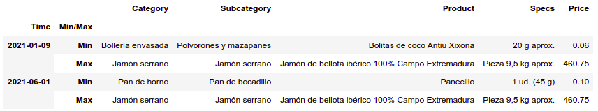

# Supermarket Scraper and Analysis

Have you ever wonder how many products Mercadona has to offer, what the most expensive product is, or even if there is some kind of mysterious relationship with the prices?

Get ready to get your mind blown with these and more Mercadona related questions answered!

## :hamburger: Why Mercadona?

  

This Spanish commerce is one of the biggest supermarkets operating in Spain. Founded in 1977, it began as a small butcher in Valencia. 

A few months ago I read a news article that stated that Mercadona was to drop its product's prices by about 10%. I've been a loyal customer of Mercadona for a couple of years by now and I haven't noticed any significant change at the counter. At first, I thought it might have been that I was buying products randomly or that my food taste got classy over time.

Days went by and finally, I brought up this subject in a friends gathering, who are as loyal to Mercadona as myself. After spending time over a beer talking about the issue, we concluded that neither of us have noticed any change in the price whatsoever. It seemed the discussion ended there, but for me, it was just the beginning.

## :inbox_tray: Getting the data

In the notebooks folder, you may find a **Scraper.ipynb** file. This notebook has everything you need to download Mercadona's data. Keep in mind it runs using selenium and a google chrome driver. If you want to use a different browser or driver you will have to change it manually. Change the browser by modifying the function `setting_up_webdriver` and the driver by uploading a new binary file to the bin folder.

Once you are all set, run all your cells. Wait for it to finish and a new file called `Mercadona_{timestamp}.csv` will appear in the data folder. 

  

## :boom: Drawing conclusions

There is another notebook you might find useful, **Pipeline.ipynb**. This notebook has everything you need to compare datasets, plot the data and draw conclusions. It has several filters to control the granularity of the analysis:

`filter_level`: Either "Category" or "Subcategory".

`filter_elements`: List of elements to filter in the given level. These are the elements we want to see in the report.

`group_level`: How you want to group the data, it can be either "Category", "Subcategory" or "Product".

`difference_type`: "actual" for real difference and "relative" for percentages.

`bar_number`: Number of categories, subcategories, or products to show (if group_level was set to categories, subcategories, or products respectively).

  

After a quick look at the data we observe that, on average, Mercadona offers around 6.400 products with prices ranging from 0.06 euros all the way up to 460.75 euros. Products are divided into "Category" and "Subcategory".

  

Now, the question at issue. **Did Mercadona drop prices by 10%?**

Well, after analyzing both, all products and its own brand (hacendado) products, we concluded that some products dropped their prices by more than 10%, however, there are other products that saw their prices risen. Unless your diet consists only of those products with lower prices, you aren't going to notice the change.

  

Find this and more charts in the charts folder: `./reporting/charts/*`

## :computer: Technology stack

Written in python 3. Main modules:

**Pandas** -> Data manipulation, cleansing and analysis.

**Selenium** -> Fetching data.

**Matplotlib** -> Charting and visualization.

## :information_source: Data info
Datasets are found in the data folder. 

  

## :nerd_face: Fun fact for geeks

There is this theorem that states that if you took a menu from any restaurant and counted the frequency of the first digit on each price, you would end up with the number 1 showing the highest frequency, about 30%, and the number 9 the lowest. I was a little skeptical about it so I decided to put our data to the test and check if the theorem holds true. 

Surprisingly, it works. 

  

I first heard about this theorem on a Netflix mini-series called Connected. It's a great show so I think you are going to enjoy it as much as I did if you are a geek like me :nerd_face:

## :love_letter: Contact info

Doubts? Advice? Drop me a line! :smirk:
